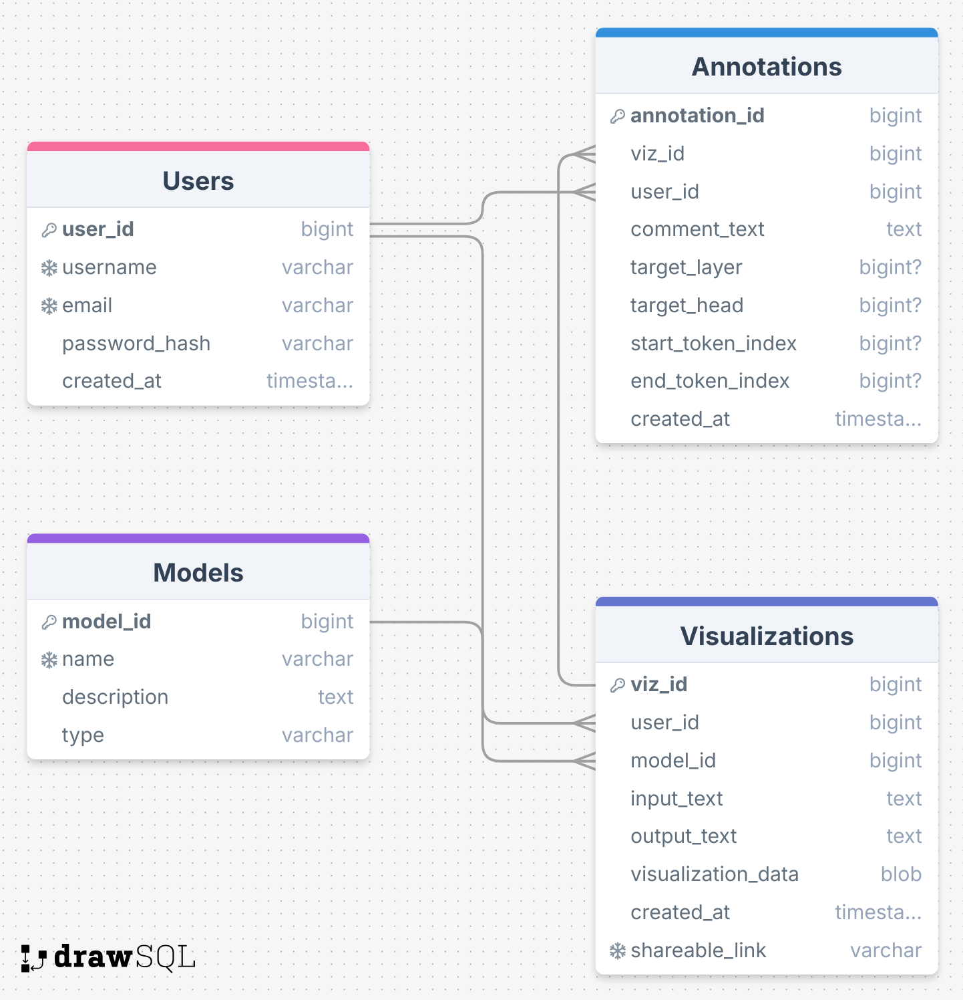
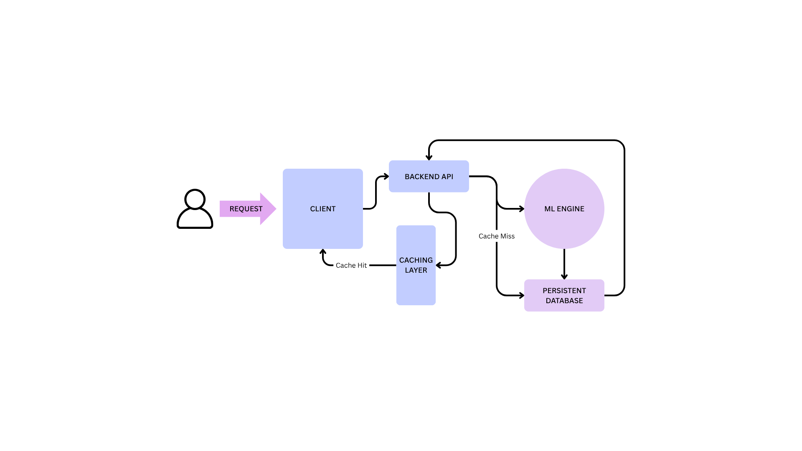

# collaborative-transformer-zoo
A web-based platform designed to demystify and collaboratively explore the internal workings of deep learning models. 

## Project Details
The *Collaborative Transformer Zoo* is a web-based platform designed to demystify and collaboratively explore the internal workings of Natural Language Processing deep learning models. Its primary purpose is to transform the currently isolated and code-heavy process of model interpretability into a shared, interactive and persistent experience.

### Project Goals
Our main goal is to enable researchers to:
- Visualize Internal States: Submit text and generate interactive visualizations of model internals from various Transformer models.
- Saving and Sharing: Permanently store these visualizations in a database, creating unique, shareable links.
- Annotation and Collaboration: Add comments and insights directly onto specific parts of visualizations, fostering a community-driven understanding of complex models.

## Initial Project Design
The following diagrams represent the initial design for the project. 
### Initial ERD

### Initial System Design Flow

### Initial Goals
- Week 1:
    - Build Core API that can run a model and render a static visualization
- Week 2:
    - Implement Database schema
    - Build the save and view functionality
- Week 3:
    - Add user authentication and the annotations table
    - Implement the commenting feature
- Week 4:
    - Implement Redis caching
    - Finalize demo and report

## Running Current Demo of Visualization Webpage
- Make sure to have huggingfacehub, fastapi[standard], bertviz, transformers, and pytorch installed
- Create a HuggingFace account, a `.env` file, and place your key in it like `HF_TOKEN=<your_token>`
- Run `uvicorn main:app --reload`